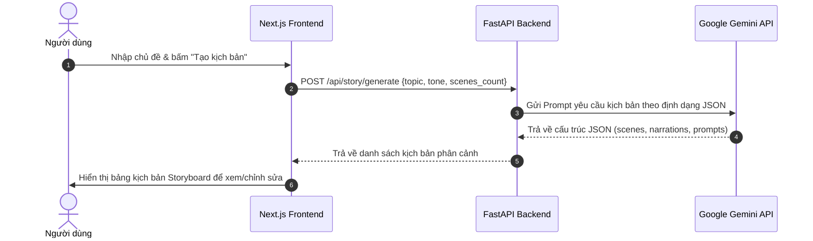
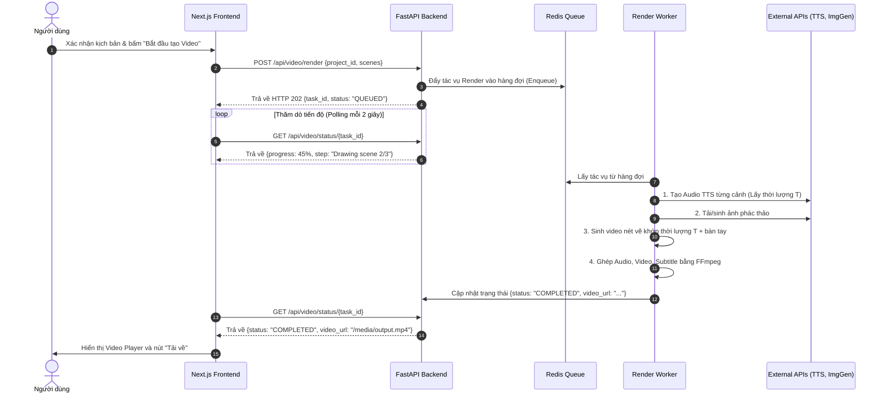

# THIẾT KẾ KIẾN TRÚC HỆ THỐNG (SYSTEM ARCHITECTURE)
## DỰ ÁN: DRAWSTORY AI

---

## 1. TỔNG QUAN KIẾN TRÚC (ARCHITECTURAL OVERVIEW)

Hệ thống DrawStory AI áp dụng mô hình **Kiến trúc phân tán tách rời (Decoupled Microservice / Client-Server Architecture)** nhằm giải quyết bài toán xử lý video tốn kém tài nguyên máy tính mà vẫn duy trì trải nghiệm người dùng tức thì và mượt mà trên giao diện Web.

```
┌─────────────────────────────────────────────────────────────┐
│                   FRONTEND CLIENT                           │
│     Next.js 14 (App Router) + TailwindCSS + Lucide Icons    │
│  - Storyboard Editor  - Live Audio Preview  - Progress Bar  │
└──────────────────────────────┬──────────────────────────────┘
                               │ HTTP / REST & SSE
                               ▼
┌─────────────────────────────────────────────────────────────┐
│                    API GATEWAY / BACKEND                    │
│                 FastAPI (Python 3.10+)                      │
│  - Request Validation  - Task Dispatcher  - Static Server   │
└──────────────┬───────────────────────────────┬──────────────┘
               │ Push Task                     │ Query Status
               ▼                               ▼
┌──────────────────────────────┐ ┌────────────────────────────┐
│      MESSAGE BROKER          │ │       METADATA DB          │
│       Redis (Queue)          │ │    SQLite / PostgreSQL     │
└──────────────┬───────────────┘ └────────────────────────────┘
               │ Pull Task
               ▼
┌─────────────────────────────────────────────────────────────┐
│               BACKGROUND RENDERING WORKER                   │
│  ├── 1. LLM Client: Google Gemini 1.5 Flash                │
│  ├── 2. TTS Generator: edge-tts                            │
│  ├── 3. Image Generator: Pollinations / Flux API            │
│  ├── 4. Vector Sketch Engine: OpenCV + Potrace              │
│  └── 5. Compositor: MoviePy + FFmpeg Subtitle Overlay       │
└──────────────────────────────┬──────────────────────────────┘
                               │ Save Video / Audio
                               ▼
┌─────────────────────────────────────────────────────────────┐
│                   STORAGE REPOSITORY                        │
│        Local Media Folder / S3 Compatible Storage           │
└─────────────────────────────────────────────────────────────┘
```

---

## 2. CÁC THÀNH PHẦN HỆ THỐNG (COMPONENT BREAKDOWN)

### 2.1. Lớp Trình diễn (Presentation Layer - Frontend)
* **Công nghệ**: Next.js (React), TailwindCSS, Zustand (quản lý state của kịch bản).
* **Trách nhiệm**:
  * Cung cấp wizard 3 bước: (1) Nhập ý tưởng -> (2) Chỉnh sửa Storyboard từng cảnh -> (3) Render & Xuất bản.
  * Tương tác bất đồng bộ với Backend qua REST API và thăm dò (polling) tiến độ render theo từng `%`.
  * Trình phát video (Video Player) hỗ trợ tỉ lệ dọc 9:16 có điều khiển tua, tải về.

### 2.2. Lớp Dịch vụ API (Application & API Layer)
* **Công nghệ**: FastAPI (Python), Uvicorn ASGI server, Pydantic (Validate dữ liệu).
* **Trách nhiệm**:
  * Xác thực yêu cầu, quản lý trạng thái các Project/Task.
  * Tích hợp nhanh với Gemini LLM để trả về kịch bản nháp chỉ trong vài giây.
  * Đẩy các tác vụ render nặng vào hàng đợi và trả về `task_id` ngay lập tức cho Frontend.

### 2.3. Lớp Hàng đợi & Điều phối (Queue & Broker Layer)
* **Công nghệ**: Redis + Celery (hoặc Python `asyncio` BackgroundTasks cho bản MVP nhẹ).
* **Trách nhiệm**:
  * Giữ hàng đợi các video chờ render theo cơ chế FIFO.
  * Đảm bảo server không bị tràn RAM/CPU khi có nhiều người dùng yêu cầu render đồng thời.

### 2.4. Lớp Xử lý Nền tảng Đồ họa (Core Processing & Rendering Pipeline)
* **Thành phần cốt lõi bao gồm 5 Module con**:
  1. `ScriptModule`: Xử lý sinh prompt, ép định dạng JSON kịch bản.
  2. `AudioModule`: Tổng hợp giọng đọc (`edge-tts`), đo đạc độ dài `duration` chính xác từng mili-giây, ghép nhạc nền.
  3. `ImageModule`: Gọi API tạo ảnh chất lượng cao theo prompt line-art phác thảo.
  4. `SketchAnimationModule`: Thuật toán Computer Vision (Canny, Contours/Potrace) tạo video nét bút chạy và toạ độ bàn tay.
  5. `CompositorModule`: Sử dụng FFmpeg/MoviePy ghép các cảnh, chèn chữ phụ đề và render ra file `.mp4` chuẩn H.264.

---

## 3. SƠ ĐỒ TUẦN TỰ (SEQUENCE DIAGRAMS)

### 3.1. Luồng 1: Nhập ý tưởng và tạo kịch bản (Script Generation)



### 3.2. Luồng 2: Quy trình Render Video bất đồng bộ (Async Video Rendering)



---

## 4. THIẾT KẾ CẤU TRÚC DỮ LIỆU DỰ ÁN (DATA SCHEMA)

### 4.1. Cấu trúc Project/Story JSON

```json
{
  "project_id": "proj_8f92a1c0",
  "title": "Sức mạnh của thói quen nhỏ",
  "topic": "Tại sao đọc sách 10 phút mỗi ngày thay đổi tương lai",
  "language": "vi",
  "voice_id": "vi-VN-HoaiMyNeural",
  "aspect_ratio": "9:16",
  "created_at": "2026-09-14T15:30:00Z",
  "status": "COMPLETED",
  "output_video_url": "/media/outputs/proj_8f92a1c0_final.mp4",
  "scenes": [
    {
      "scene_id": 1,
      "narration": "Bạn có biết, chỉ 10 phút đọc sách mỗi ngày có thể biến đổi hoàn toàn tư duy của bạn?",
      "image_prompt": "Clean minimal ink sketch, a person sitting under a tree reading a book with glowing ideas floating, white background, high contrast line art",
      "image_url": "/media/images/proj_8f92a1c0_scene_1.png",
      "audio_url": "/media/audios/proj_8f92a1c0_scene_1.mp3",
      "audio_duration": 5.4,
      "video_clip_url": "/media/clips/proj_8f92a1c0_scene_1.mp4"
    }
  ]
}
```

---

## 5. MÔI TRƯỜNG VÀ ĐẶC TẢ THƯ MỤC LƯU TRỮ

Hệ thống quản lý dữ liệu tạm thời (temp artifacts) theo cơ chế cô lập theo từng phiên làm việc:
```
backend/
├── data/
│   ├── temp/              # Lưu file ảnh, audio tạm từng cảnh
│   ├── assets/            # Ảnh bàn tay (hand_pen.png), nhạc nền (bgm.mp3), font chữ (.ttf)
│   └── outputs/           # File video hoàn chỉnh đã render (.mp4)
```
Tất cả các file tạm trong `temp/` sẽ được thiết lập cơ chế tự động dọn dẹp sau 24 giờ để tối ưu dung lượng lưu trữ ổ đĩa.
